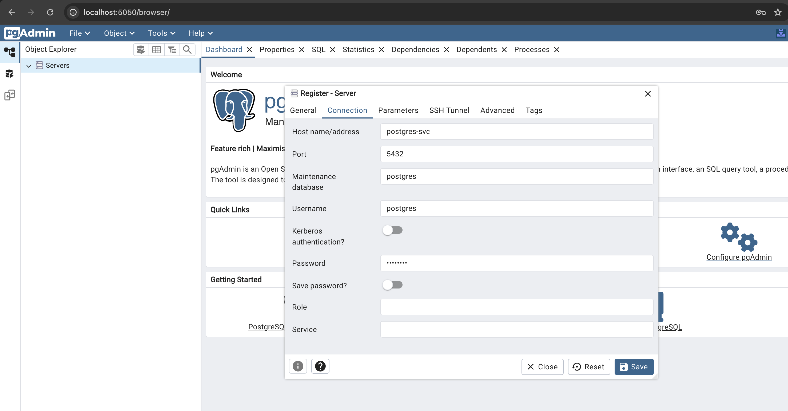
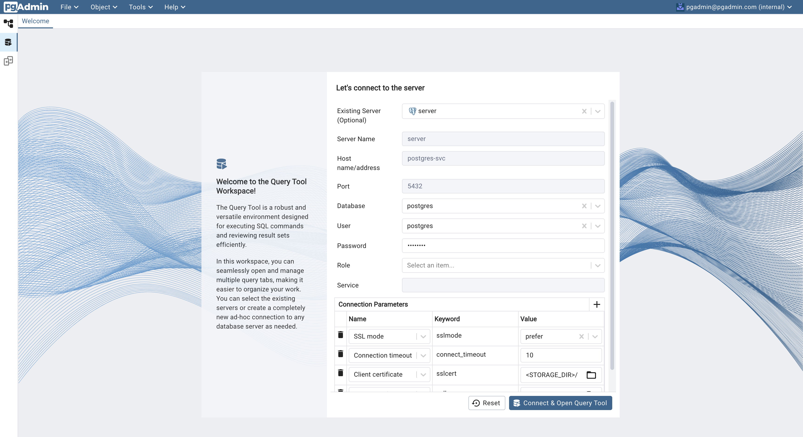
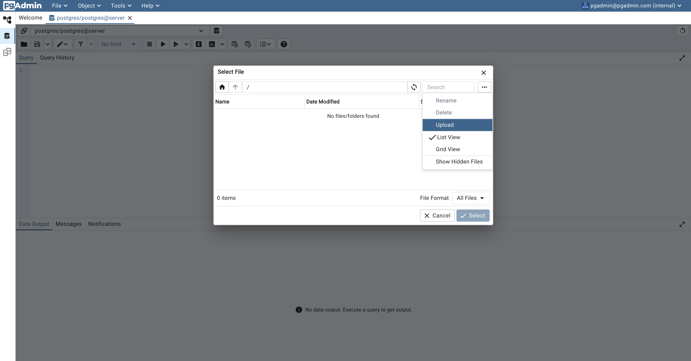
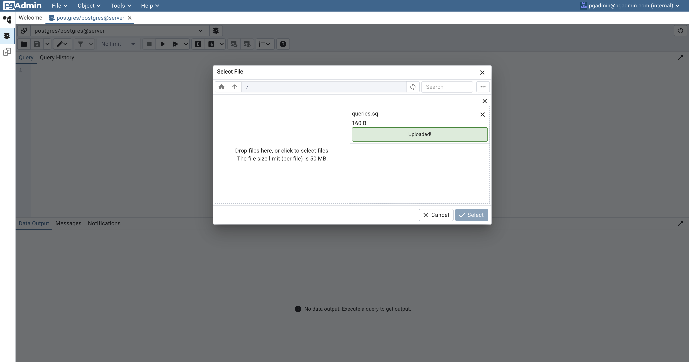
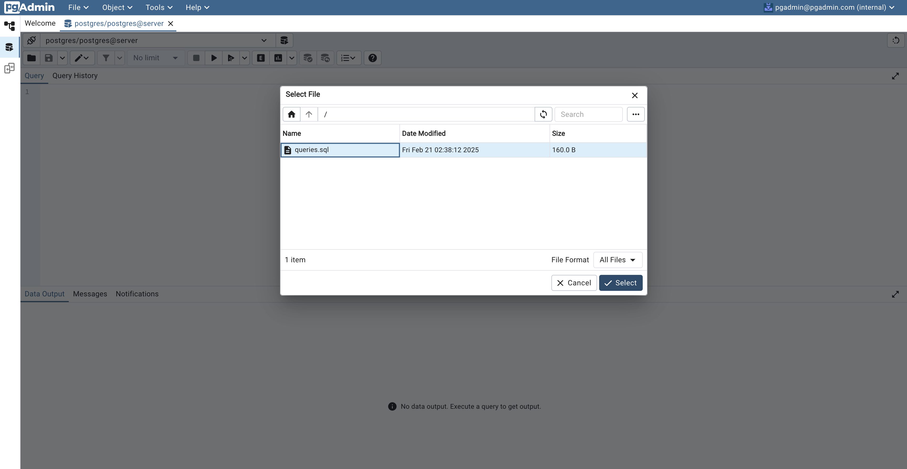
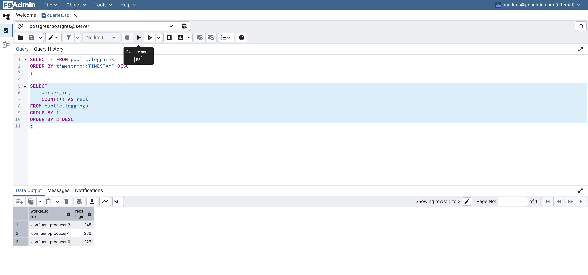
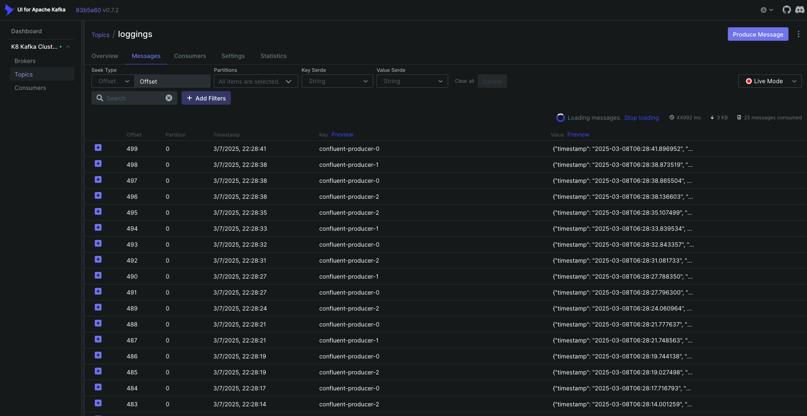
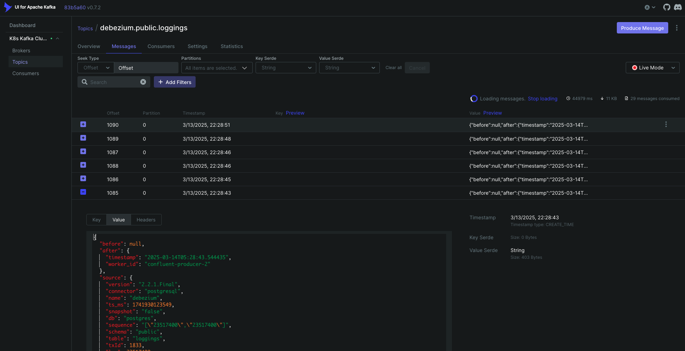

# Kind of Koncept (aka. POC w/ kind) 😜

## Architecture

[--- Python ---] --> [--- Kafka ---] --> [--- JDBC Sink Connector] --> [--- PostgreSQL ---] --> [--- Debezium Source Connector ---] --> [--- Kafka ---] [--- Spark ---]

[------------------------------------------------------------------------------ Kubernetes ---------------------------------------------------------------------------]

## Prerequisites

- [Docker](https://docs.docker.com/engine/install/)
- [Kind](https://kind.sigs.k8s.io/docs/user/quick-start/#installation)

## Walkthrough

1. Start up: `./scripts/start`
2. Check status: `./scripts/status`
3. View pgAdmin at `localhost:5050`
    - *LOGIN (password "postgres")* 
    - *CONNECT* 
    - *UPLOAD*   
    - *QUERY* 
4. View Kafka UI at `localhost:5051`
    - *TOPIC (JDBC Sink Connector)* 
    - *TOPIC (Debezium Source Connector)* 
    ***If `debezium.public.loggings` topic doens't show up or isn't ingesting more messages, run `./script/dbzm` to reboot the connector.**
5. Shut down: `./scripts/stop`
